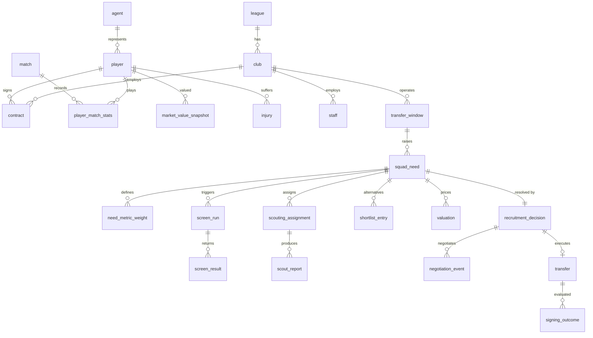

# Synthetic Recruitment Database (draft v0.1)

**Organization:** mid-table club in a top European league
**Decision-maker:** Head of Recruitment
**Decision:** For each squad need in a transfer window, which player do we pursue, and at what maximum fee and wage? Or do we not sign at all?

## 1. Empirical base: StatsBomb Open Data

Checked all 80 competition-seasons in the repo (commit `4b73468`, Sep 2026).
Only four are complete domestic league seasons for men:

| League | Season | Matches | Teams | Used |
|---|---|---|---|---|
| Premier League | 2015/16 | 380 | 20 | Yes |
| La Liga | 2015/16 | 380 | 20 | Yes |
| Serie A | 2015/16 | 380 | 20 | Yes |
| Ligue 1 | 2015/16 | 377 | 20 | Yes (3 matches missing upstream) |
| 1. Bundesliga | 2015/16 | 34 | 18 | No. Leverkusen matches only |
| La Liga | 2004/05 to 2020/21 | 7 to 38 each | | No. Barcelona matches only |

Other full sets (WSL, NWSL, Liga F, World Cups, Euros) are usable later as extra "markets".

Sanity checks passed: Suárez 40 goals, Higuaín 36, Ronaldo 35, Kane 25.
Leicester champions on 81 points. Each team logs about 1,032 player-minutes per match (11 × ~94).

## 2. Pipeline

```
pipeline/01_fetch_statsbomb.py    download 1,517 matches (events + lineups, ~4.3 GB)
pipeline/02_profile_statsbomb.py  events -> player_match, player_season, team_season, calibration.json
schema/schema.sql                 27 tables + 1 view, runs on SQLite and PostgreSQL
calibration/                      outputs of step 2 (aggregates only)
```

Run: `python 01_fetch_statsbomb.py --out ../raw` then `python 02_profile_statsbomb.py`. Takes about 35 seconds on 2 cores.

`calibration.json` holds what the generator samples from:
- per-90 quantiles, means and SDs for about 50 metrics, by position group (GK, CB, FB, DM, CM, AM, W, ST), for players with 900+ minutes
- Spearman correlations between 11 core metrics per position group, so synthetic players have realistic profiles (a striker with high npxG also tends to win aerials, and so on)
- league medians, squad-size and minutes-share distributions, nationality mix per league, team strength (points, xG, xGA)

**License note:** StatsBomb data is non-commercial, no redistribution. The `calibration/` CSVs contain real player names. Keep them out of the shared database. The final database holds only synthetic players sampled from these distributions.

## 3. Schema



How the brief maps to the tables:

| Brief element | Tables |
|---|---|
| Decision role | `staff` (role = head_of_recruitment), `recruitment_decision.decided_by` |
| Place in workflow | need → screen → scout → shortlist → value → decide → negotiate → transfer → outcome |
| Cases | `squad_need` |
| Entities | `player`, `club`, `agent`, `staff` |
| Events | `match`, `player_match_stats`, `injury`, `negotiation_event`, `transfer` |
| Resources and constraints | `transfer_window` (budgets, squad size, non-EU, homegrown), `squad_need` (fee, wage, age caps) |
| Information | `player_season_profile`, `scout_report`, `screen_result`, `market_value_snapshot` |
| Alternatives | `shortlist_entry`, `valuation` |
| Outcomes | `recruitment_decision`, `transfer`, `signing_outcome` |

**Hidden ground truth.** `player.latent_ability`, `player.latent_potential`, `staff.rating_bias` and `staff.rating_noise_sd` are the generator's truth. The tool must never read them. They drive stats, scout ratings and post-signing outcomes, so the validation suite can test whether the tool picks players who actually turn out well.

## 4. Open questions for the team

1. **Focal club and league.** Which league do we sit in? This sets budget scale and the strength coefficient.
2. **Time span.** Suggest 3 fictional seasons: two seasons of history to scout from, one season to observe outcomes.
3. **Market size.** Suggest the four calibrated leagues (80 clubs, about 2,300 players) plus one or two lower-strength leagues as "value markets".
4. **Valuation calibration.** StatsBomb has no fees or wages. We need published ranges (e.g. CIES Football Observatory, UEFA benchmarking reports) to set fee and wage distributions by age, position and league.
5. **Granularity.** Player-match level stats (about 100k rows per season) or player-season only? Match level supports form and consistency features. Season level is simpler.

## 5. Next steps

- `generator/`: seeded generator that samples players from `calibration.json` via a Gaussian copula, simulates seasons, then runs the recruitment workflow.
- `validation/`: checks for referential integrity, business rules (budget never exceeded, one decision per need), and distribution fidelity (KS tests vs StatsBomb quantiles).
